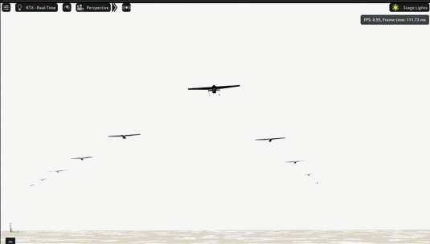
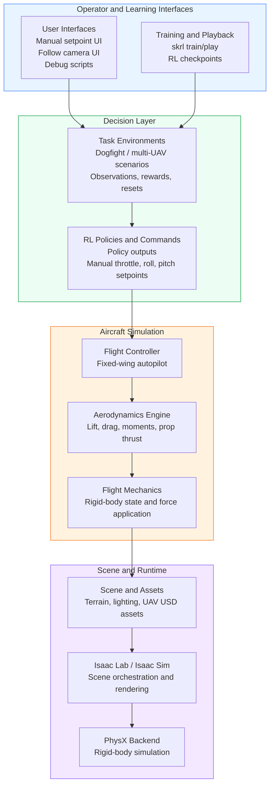

# UAV Lab
End-to-end software stack to train fixed-wing UAV policies.
Check the [demo!](https://youtu.be/vJGbIgS7SR4?si=85nzMvPeHLRmRvV5)

## Software Stack

## Stack Layers

- `User Interfaces`: Manual control panels, follow-camera controls, and visualization scripts.
- `Training and Playback`: skrl-based training, policy checkpointing, and policy replay.
- `Task Environments`: Multi-UAV task definitions, observations, rewards, resets, and termination logic.
- `Guidance and Control`: RL/manual setpoints and fixed-wing autopilot loops.
- `Aircraft Simulation`: Flight mechanics, aerodynamics, and force/torque application.
- `Scene and Assets`: Isaac Lab scene configuration, terrain, lighting, and UAV assets.
- `Simulation Runtime`: Isaac Sim, Isaac Lab, and PhysX execution backend.
